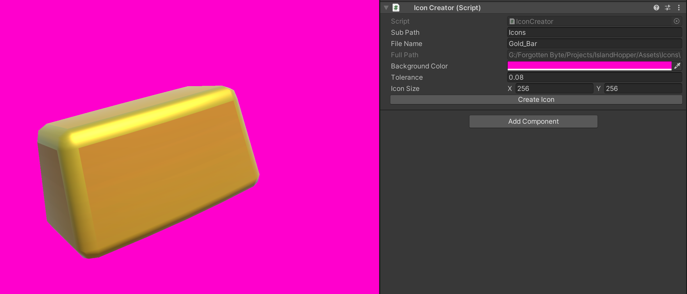

# Island Hopper

## Steam ([View game on ](https://store.steampowered.com/app/2326260/Island_Hopper/))

We released the game ourselves on Steam on 20.10.2023.

## Gameplay Video

## About the Game

Island Hopper is a relaxing game in which you venture to randomly generated islands.
Collect as much resources from different places to rebuild your home and unlock further possibilities

### Resource Collection
Collect materials from different island types.
Use your collected resources to sell them to stack up on gold or upgrade your equipment and skills!
Island Biomes
Island Hopper provides four unique island types which hold their own hazards and resources.
Embark on journeys to all biomes to get the resources you need.

### Upgrades
Upgrade your collection device and character skills to improve your gathering speed and efficiency!
Can you upgrade all your gear?

### Combat
On your journeys to all the islands there will be a lot of dangerous enemies.
Make sure you're prepared accordingly to defeat them!

## Code Samples

### Icon Creator ([View Script](scripts/IconCreator.cs))

This script was written to generate icons of 3D objects, which are later used in the UI of the inventory.
For this i created an empty scene where i place the 3D object in front of the main camera.
The background color of the camera can be adjusted in the inspector of the script. This serves as a green screen, which is removed when the icon is created.
For a good result, the resolution of the game view should correspond to the icon size. This step still needs to be optimised.

#### Inspector and game view

#### Result

### Puzzle ([View Script](scripts/Puzzle.cs)))

This is the parent script of all puzzles in the game.
It contains functions like `ResetPuzzle()`, `SolvePuzzle()` and `FailPuzzle()`.

#### Sequence Puzzle ([View Script](scripts/SequencePuzzle.cs))

In this puzzle, the switches must be pressed in the correct order.

